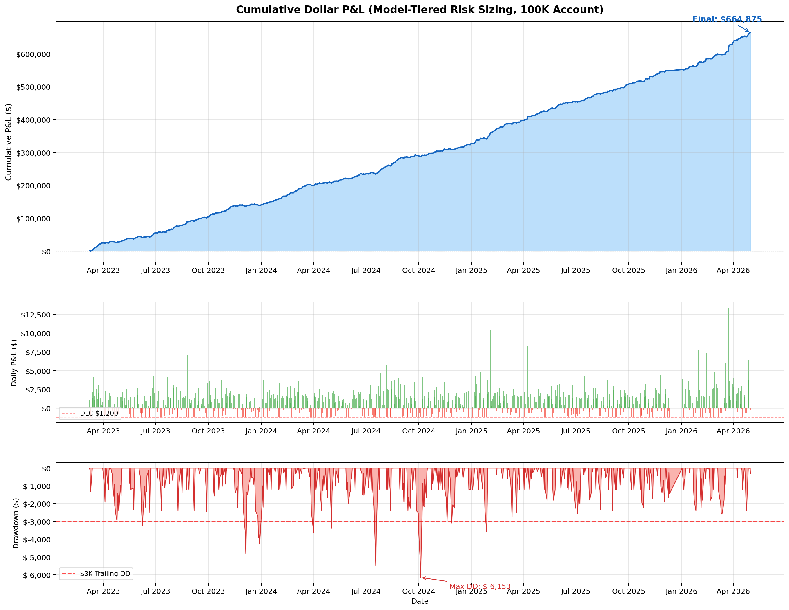
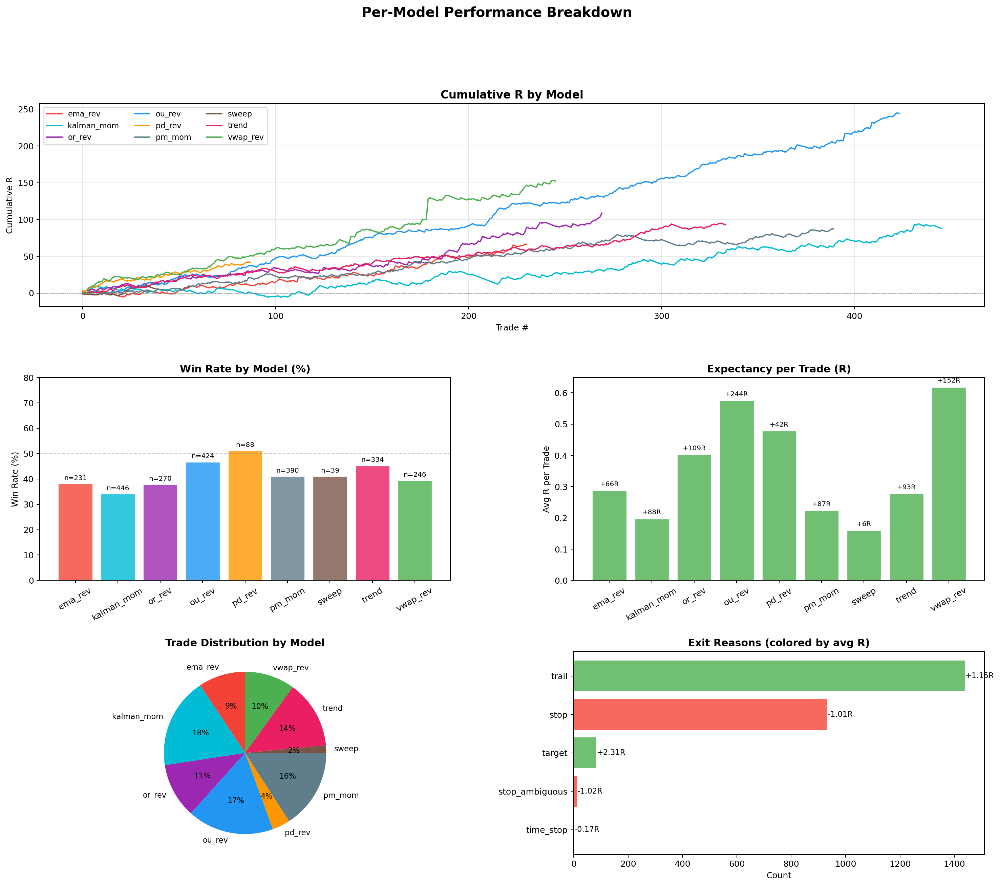
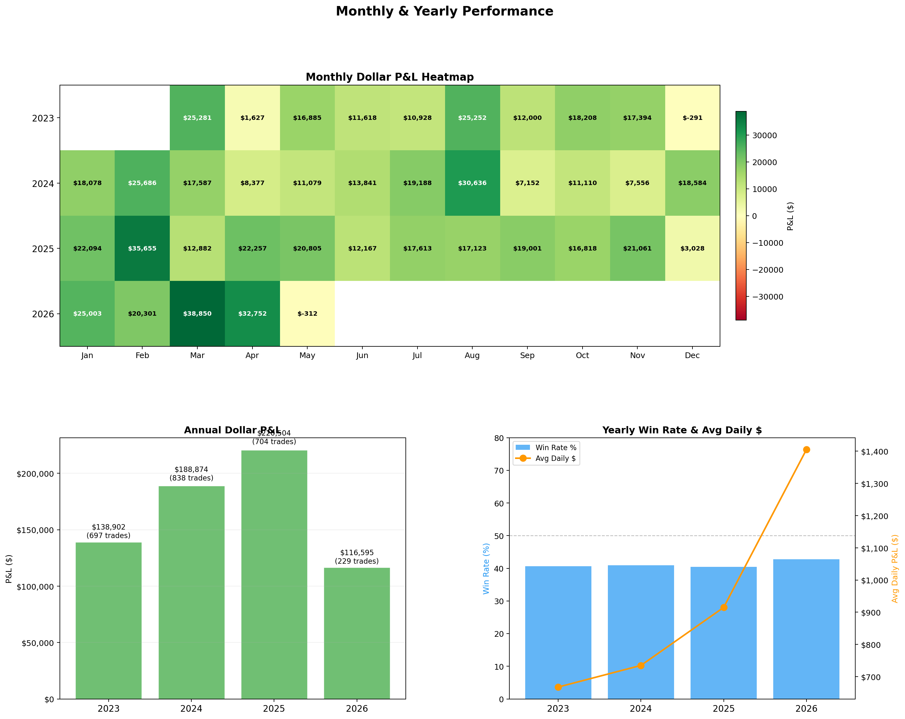
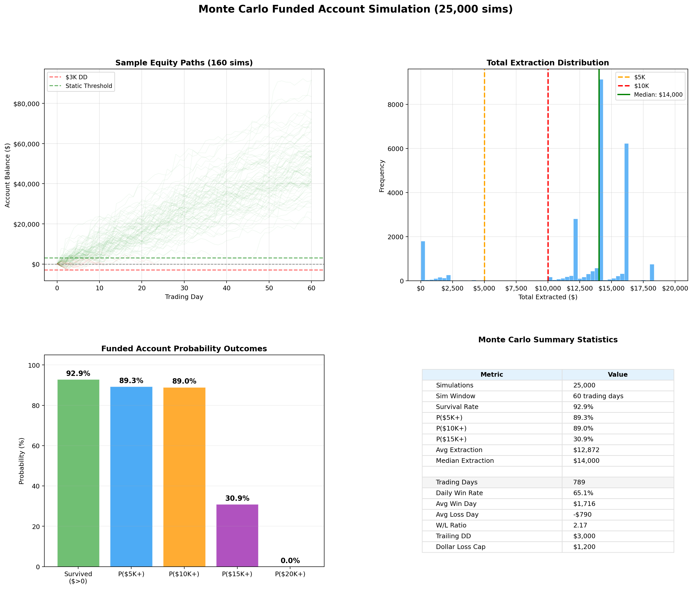
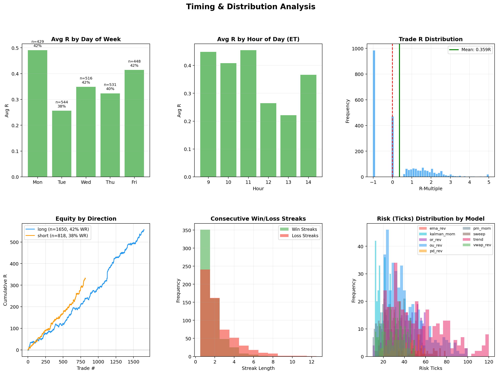
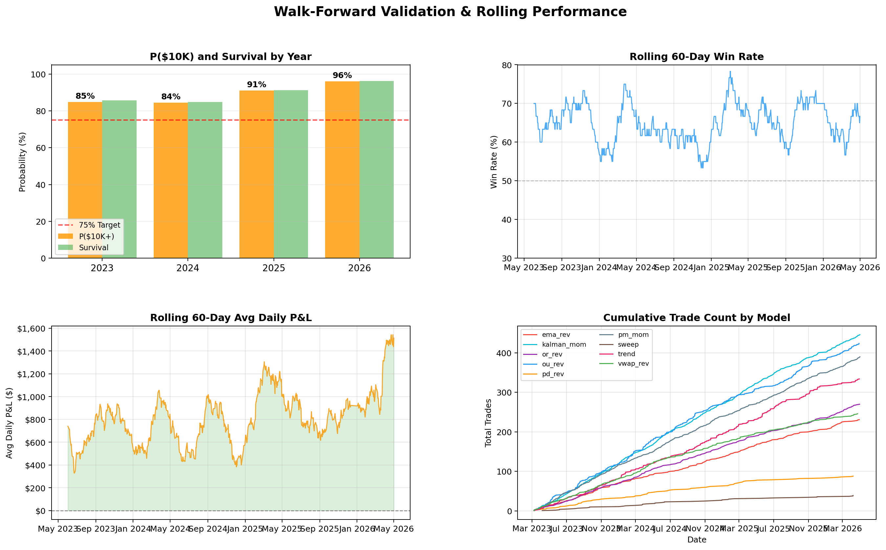

# NQ-ES Trader

Autonomous MNQ futures trading system for TopStepX 100K funded accounts. Runs 9 quantitative models with model-tiered risk sizing, funded account simulation, and Monte Carlo payout analysis.

Backtest and live execution use identical config - what you see in the charts is what runs on your account.

---

## Performance Overview

| Metric | Value |
|---|---|
| Eval Pass Rate (MC) | 89.4% |
| Median Days to Pass | 7 |
| P($10K payout in 60 days) | 89.0% |
| Survival Rate | 92.9% |
| Avg Extraction | $12,872 |

| Metric | Value |
|---|---|
| Total Trades | 2,468 |
| Trading Days | 789 |
| Trades/Day | 3.1 |
| Win Rate | 40.9% |
| Profit Factor | 1.89 |
| Expectancy | +0.36R per trade |
| Total R | +887R |
| Avg Win | +1.87R |
| Avg Loss | -0.69R |

---

## Charts

### Equity Curve & Drawdown


### Per-Model Performance


### Monthly & Yearly Performance


### Monte Carlo Funded Simulation (25,000 sims)


### Timing & Distribution Analysis


### Walk-Forward Validation


---

## TopStepX Account Rules

### Evaluation (100K)

You must pass the eval before getting a funded account.

| Rule | Value |
|---|---|
| Profit target | $6,000 |
| Trailing drawdown | $3,000 |
| No static floor | DD trails from peak at all times |
| No time limit | Trade until you hit $6K or blow the $3K DD |

**Monte Carlo eval result:** 89.4% pass rate across 25,000 simulations. Median 7 trading days to pass, 90th percentile 13 days.

### Funded Account (100K XFA)

Once you pass the eval, the funded account has different rules.

| Rule | Value |
|---|---|
| Starting balance | $100,000 |
| Trailing drawdown | $3,000 (trails upward with profit) |
| Static floor | Locks at $0 P&L when peak profit >= $3,000 |
| Dollar loss cap | $1,200/day |
| Max payout | $2,000 per withdrawal |
| Payout cap | 50% of current balance |
| Green day minimum | $200 profit |
| Green days per payout | 5 |
| Post-static scaling | 1.25x P&L when balance > $3K above start |

### How Payouts Work

1. Trade until peak profit hits $3K - drawdown floor locks (static phase)
2. Every 5 green days ($200+), withdraw min($2,000, 50% of balance)
3. Keep trading and withdrawing - balance fluctuates but floor is locked at $0
4. Monte Carlo: 89% of 25K simulations extract $10K+ in 60 trading days

---

## Strategy

### 9-Model Architecture

| # | Model | Type | Priority | Risk | Description |
|---|---|---|---|---|---|
| 1 | OU Reversion | Mean-reversion | 15 | $2,500 | Ornstein-Uhlenbeck on price-VWAP deviation. Fits stochastic process, trades when half-life is short and Hurst < 0.45. Quality-filtered (Q>=4). |
| 2 | PD Level Reversion | Mean-reversion | 22 | $1,200 | Fades at previous day high/low with reversal candle confirmation. Institutional reference levels. |
| 3 | VWAP Reversion | Mean-reversion | 25 | $600 | Bidirectional VWAP z-score fade (z > 2.0 short, z < -2.0 long). Targets snap-back to session VWAP. |
| 4 | Opening Range Rev | Mean-reversion | 28 | $600 | Fades extended moves beyond first 15 min of RTH back to OR midpoint. Window: 10:00-12:00 ET. |
| 5 | EMA Reversion | Mean-reversion | 30 | $600 | Fades when price extends 2.5+ std devs from 20-period EMA. Window: 9:50-14:30 ET. |
| 6 | Sweep Reversal | Mean-reversion | 35 | $600 | Liquidity sweep at PDH/PDL/session extremes followed by immediate reversal. Detects stop hunts. |
| 7 | Kalman Momentum | Momentum | 40 | $600 | Trades Kalman filter slope direction when Hurst >= 0.5. Requires 5-bar slope consistency. Window: 10:15-14:00 ET. |
| 8 | Trend Continuation | Momentum | 40 | $600 | Follows EMA/regime trends with fair value gap (FVG) pullback entries. |
| 9 | PM Momentum | Momentum | 50 | $600 | Afternoon session Kalman slope pullback model. Window: 13:30-15:00 ET. |

### Per-Model Results

| Model | Trades | Win Rate | Expectancy | Total R |
|---|---|---|---|---|
| ou_rev | 424 | 47% | +0.576R | +244.0R |
| vwap_rev | 246 | 39% | +0.618R | +152.1R |
| or_rev | 270 | 38% | +0.402R | +108.7R |
| trend | 334 | 45% | +0.278R | +92.8R |
| kalman_mom | 446 | 34% | +0.197R | +87.8R |
| pm_mom | 390 | 41% | +0.224R | +87.2R |
| ema_rev | 231 | 38% | +0.287R | +66.4R |
| pd_rev | 88 | 51% | +0.478R | +42.0R |
| sweep | 39 | 41% | +0.160R | +6.2R |

### Walk-Forward Validation

Each year is tested out-of-sample using only data from that year.

| Year | P($10K) | Survival | Avg Extraction |
|---|---|---|---|
| 2023 | 84.8% | 85.6% | $11,979 |
| 2024 | 84.4% | 84.7% | $12,177 |
| 2025 | 91.1% | 91.1% | $13,680 |
| 2026 | 96.0% | 96.2% | $13,441 |

---

## Signal Flow

```
1-min bars --> compute_vwap() + compute_opening_range()
          --> compute_all_quant_features() (OU, Hurst, Kalman, Parkinson, BB)
          --> 9 models generate signals independently
          --> filter: cut off after 2:30 PM ET
          --> resolve conflicts: 5-bar cooldown, priority-based (lower # wins)
          --> quality filter: OU needs Q>=4, all others pass through
          --> engine: simulate trades with BE/trail/time-stop
```

### Quantitative Features

All computed in `strategy/quant/features.py`:

- **Ornstein-Uhlenbeck process** - Rolling OLS on price-VWAP deviation to estimate mean-reversion speed (theta), half-life, and z-score. Window: 60 bars.
- **Hurst exponent** - Variance-ratio method (16-bar vs 1-bar returns) for regime classification. H < 0.45 = mean-reverting, H > 0.55 = trending. Window: 120 bars.
- **Kalman filter** - 2x2 state-space model estimating level + slope. Inline matrix math for speed on 1M+ bars.
- **Parkinson volatility** - High-low range estimator, more efficient than close-to-close. Window: 30 bars.
- **Bollinger Band squeeze** - BBW percentile for volatility expansion detection. Window: 20 bars, 120-bar lookback.

---

## Exit Mechanics

All models use the same exit profile:

| Parameter | Value | Description |
|---|---|---|
| Partial profit (pp) | 0.0 | No partial-taking. Lets winners run to full target or trail exit. |
| Trail (tp) | 0.001 | Once MFE >= 0.5R, trailing stop activates 0.1% behind max favorable excursion. Target disabled - trail IS the exit. |
| Breakeven (be) | 0.6R | Move stop to entry once trade moves 0.6x risk in your favor. Trade becomes risk-free. |
| Time stop | 30-45 min | Close at market if trade hasn't hit breakeven within model's time limit. |
| Session close | 4:59 PM ET | Flatten everything. No overnight positions. |

---

## Daily Controls

| Control | Value | Description |
|---|---|---|
| Daily win cap | 2.0R | Stop taking signals once daily R reaches +2.0. Protects a good day. |
| Max daily loss R | No limit | Allows intraday recovery. A -1R trade can be followed by a +3R winner. |
| Dollar loss cap | $1,200 | Daily P&L truncated at -$1,200. Hard protection. |
| Consec cooldown | 10 | After 10 straight losses, skip next signal. Circuit breaker. |
| Max concurrent | 1 | One trade at a time. No overlapping positions. |

---

## Risk Sizing

Model-tiered dollar risk per trade:

| Tier | Models | Risk/Trade | Rationale |
|---|---|---|---|
| High | ou_rev | $2,500 | Highest edge (47% WR, +0.576R), quality-filtered |
| Medium | pd_rev | $1,200 | High WR (51%), strong at institutional levels |
| Standard | 7 other models | $600 | Diversified coverage across conditions |

**Contract formula:** `min(50, floor(risk_dollars / (risk_ticks * $0.50)))`

Examples:
- OU signal, 40 ticks risk = floor($2,500 / (40 * $0.50)) = 125, capped at 50 MNQ
- Kalman signal, 30 ticks risk = floor($600 / (30 * $0.50)) = 40 MNQ

---

## Quick Start

### 1. Prerequisites

- Python 3.10 or higher
- Mac: `brew install python`
- Windows: download from [python.org](https://www.python.org/downloads/) (check "Add to PATH")

### 2. Install

```bash
git clone https://github.com/s-k-28/nq-es-trader-2.git
cd nq-es-trader-2
pip install -r requirements.txt
```

### 3. Run Backtest

```bash
python generate_charts.py
```

Runs the full 9-model backtest on 2022-2026 data, generates 6 chart PNGs, runs both eval pass and funded account Monte Carlo simulations, and prints the complete summary with per-model breakdown.

### 4. Launch Dashboard

```bash
python frontend/server.py
```

Open [http://localhost:8080](http://localhost:8080). Four tabs:

- **Interactive Charts** - Equity curve, per-model equity, monthly P&L, win rates, R distribution, DOW/hour analysis. Filter by period and toggle models.
- **Deep Analysis** - Pre-rendered matplotlib charts (equity/drawdown, model breakdown, monthly heatmap, timing, walk-forward)
- **Monte Carlo** - Eval pass rate, funded account simulation results, probability outcomes
- **Strategy Rules** - Complete configuration reference for all models, exits, risk, and TopStepX rules

### 5. Run Live Bot

```bash
cp .env.example .env
```

Edit `.env` with your TopStepX credentials:

```
TOPSTEP_USER=your_topstep_username
TOPSTEP_API_KEY=your_api_key
TOPSTEP_ENV=demo
```

Get your API key from: TopStepX dashboard > API Access.

```bash
python run_live.py              # demo mode (default)
python run_live.py --env live   # real funded account
```

The bot connects to TopStepX via REST API, loads ~83 days of 1-min history for regime warmup, then trades all 9 models autonomously. Same config as backtest: model-tiered risk, 2.0R win cap, $1,200 DLC, BE at 0.6R, 0.001 trail, no partials.

Press `Ctrl+C` to stop and flatten all positions.

### 6. Backtest on Custom Data

```bash
python run_multi.py --nq data/Dataset_NQ_1min_2022_2025.csv
python run_multi.py --nq data/mnq_2026_1min.csv --history data/Dataset_NQ_1min_2022_2025.csv
```

---

## Project Structure

```
nq-es-trader/
  config.py                        # All parameters: strategy, risk, funded account rules
  generate_charts.py               # Full backtest + eval MC + 6-chart dashboard
  run_live.py                      # Live bot entry point (TopStepX 100K)
  run_multi.py                     # Backtest runner with per-model reporting

  strategy/
    multi.py                       # Signal orchestrator: generate, filter, resolve conflicts
    quality.py                     # OU quality scoring (Q>=4 filter)
    vwap.py                        # Session VWAP + 15-min opening range
    quant/
      features.py                  # OU, Hurst, Kalman, Parkinson, BB squeeze
    models/
      __init__.py                  # ALL_MODELS registry (9 models)
      base.py                      # BaseModel, Signal, ModelRiskProfile dataclasses
      ou_reversion.py              # OU mean-reversion (pri=15, $2,500)
      pd_level_reversion.py        # Previous day level fade (pri=22, $1,200)
      vwap_reversion.py            # VWAP z-score reversion (pri=25)
      or_reversion.py              # Opening range reversion (pri=28)
      ema_reversion.py             # EMA mean-reversion (pri=30)
      sweep_reversal.py            # Liquidity sweep reversal (pri=35)
      kalman_momentum.py           # Kalman filter momentum (pri=40)
      trend_cont.py                # Trend continuation with FVG (pri=40)
      afternoon_momentum.py        # PM session momentum (pri=50)

  backtest/
    engine_v2.py                   # Backtester: trail, BE, partials, time stops, win cap
    funded_sim.py                  # Eval pass + funded account Monte Carlo simulators
    metrics_v2.py                  # Trade metrics, per-model breakdown

  data/
    loader.py                      # CSV loader, resampler, daily bar builder
    Dataset_NQ_1min_2022_2025.csv  # NQ 1-min data (2022-2025)
    mnq_2026_1min.csv              # MNQ 1-min data (2026)

  live/
    broker_topstep.py              # TopStepX REST API: auth, orders, positions, bars
    executor_multi.py              # Live executor: model-tiered sizing, same config as backtest

  frontend/
    index.html                     # Interactive dashboard (4 tabs, Chart.js)
    server.py                      # Dashboard server (trade API + chart images)
```
